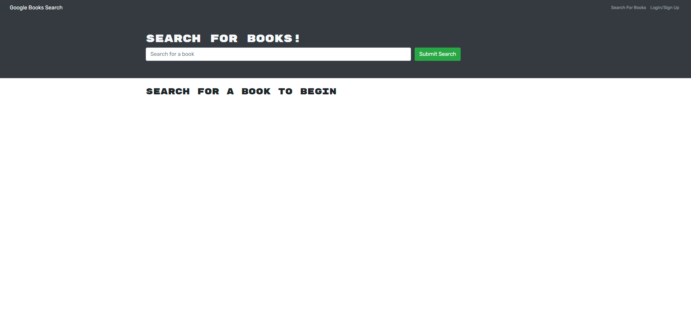
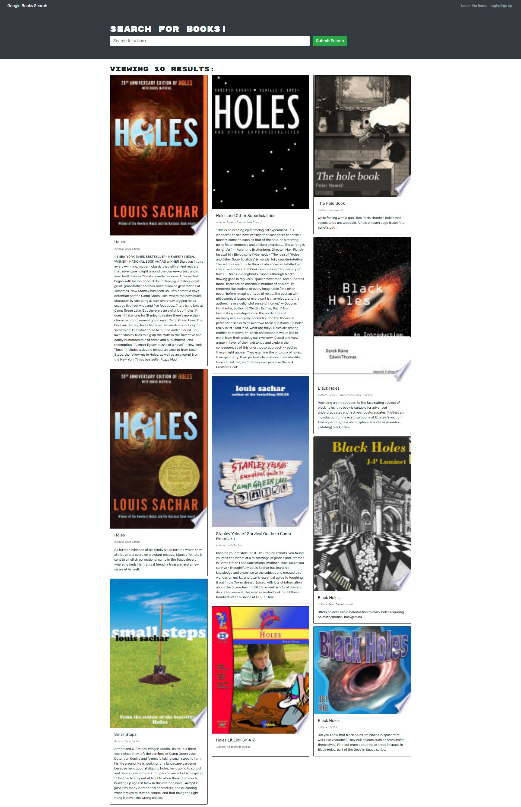

# book-search

## Description

Book search is a full stack MERN application.  Allowing users to search for any related book using the Google Books API.  Users can create an account that provides access to save books along with a user-friendly dashboard.

## Technologies Used

* Mongoose
* Express
* React
* Node.js
* Javascript
* Apollo-server
* Graphql

## Installation

Clone the repo and rum `npm install` from the root directory.  Run `npm start` and navigate to localhost:3000 in your browser to open the application locally.

## GitHub Repo and Deployed Link

[Link to Github](https://github.com/adambowers09/book-search)

[Link to Heroku]()

## Screenshots

#### Application Homepage:

#### Application Search Results:

